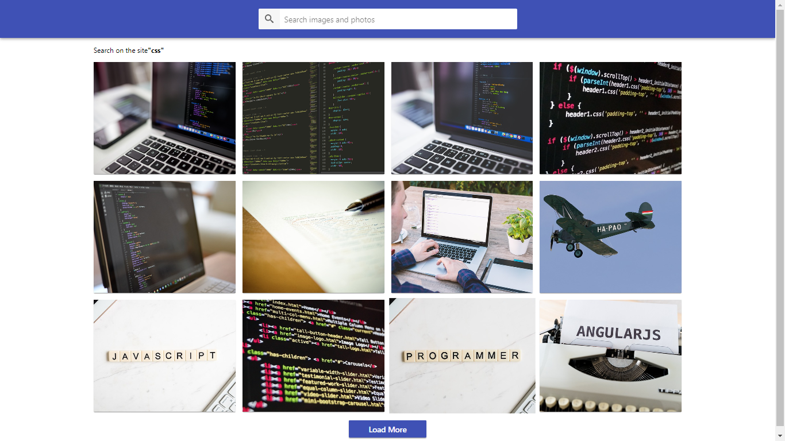

# Pixabay API Search



> This project implements a simple web application that allows users to search
> for images using the Pixabay API.

This project utilizes hooks for efficient state management of components.

## Key Features

- **Image Search**: Users can enter keywords in the search field and retrieve
  corresponding images from the Pixabay API.

- **Load More Images**: During scrolling, users can load additional images by
  clicking the "Load More" button. Hooks are used for efficient state and data
  loading management.

## Installation and Running

To run the project locally, use the following commands:

```bash
npm install
npm start
```

These commands will install all the necessary dependencies and launch the web
application on the local server.

## Technologies and Tools

The project is implemented using React and incorporates the use of hooks for
convenient state management of components.

### For additional information and documentation on the Pixabay API, visit [Pixabay's official website](https://pixabay.com/).
